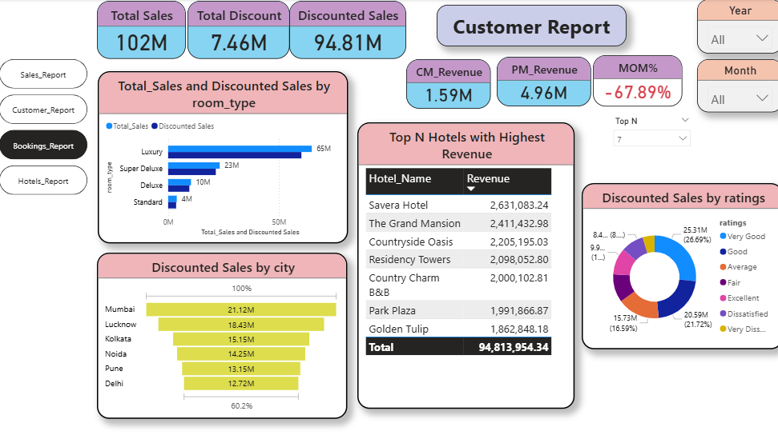

# Hotel Booking Dashboard using Power BI

## 📌 Project Overview

This project is an interactive Hotel Booking Dashboard developed using Power BI to analyze hotel booking trends, customer behavior, ratings, and transaction insights.

The dashboard provides meaningful business insights through interactive visualizations and helps in understanding booking patterns, hotel performance, customer engagement, and overall analytics.

---


## 🎯 Objective

The main objective of this project is to:

- Analyze hotel booking data
- Track customer booking behavior
- Monitor hotel ratings and performance
- Visualize transaction and booking insights
- Build an interactive business intelligence dashboard

---

## 🛠 Tools & Technologies Used

- Power BI
- Power Query
- DAX
- CSV Files
- Data Visualization

---

## 📂 Dataset Files

- bookings.csv
- hotels.csv
- ratings.csv
- users.csv

---

## ⚙️ Dashboard Features

- Booking trend analysis
- Hotel performance tracking
- Customer behavior insights
- Rating distribution analysis
- Interactive filters and slicers
- Dynamic charts and visualizations

---

## 📊 Key Insights

- Identified top-performing hotels based on ratings
- Analyzed customer booking trends
- Compared hotel booking performance
- Visualized user engagement and ratings data

---
## 📷 Dashboard Preview


```

---

## 🚀 Skills Demonstrated

- Data Cleaning
- Data Modeling
- Dashboard Development
- Business Intelligence
- Data Visualization
- Power BI Reporting
- Analytical Thinking

---

## 🧠 Conclusion

This project demonstrates the practical use of Power BI for transforming raw hotel booking data into meaningful business insights through interactive dashboards and visual analytics.

---
